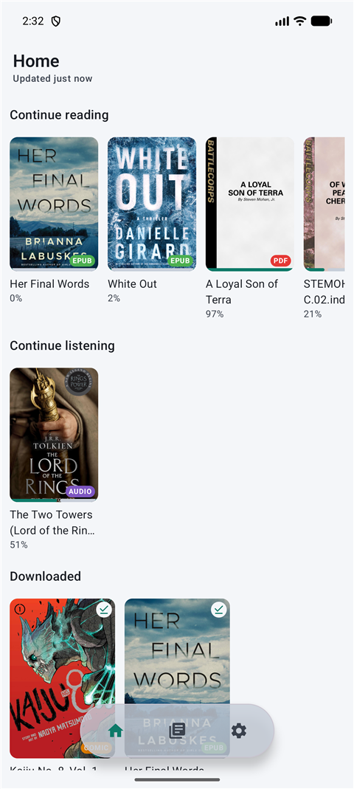
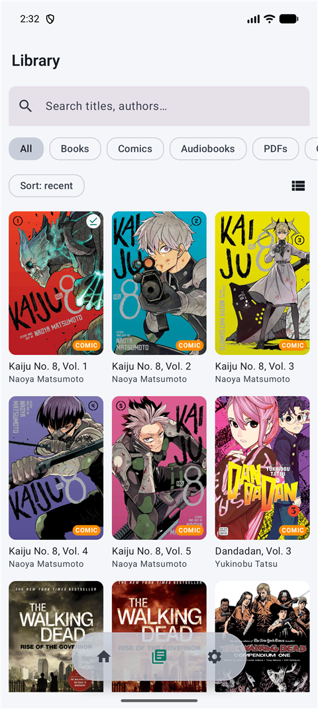
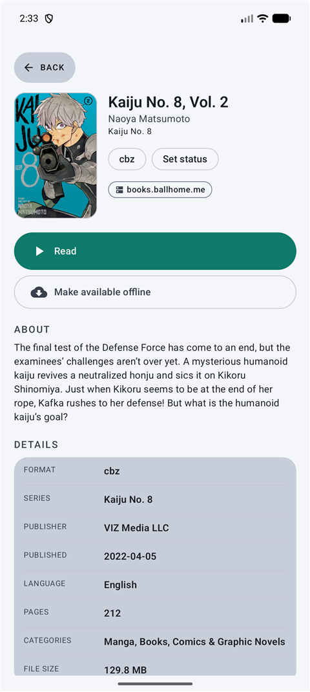
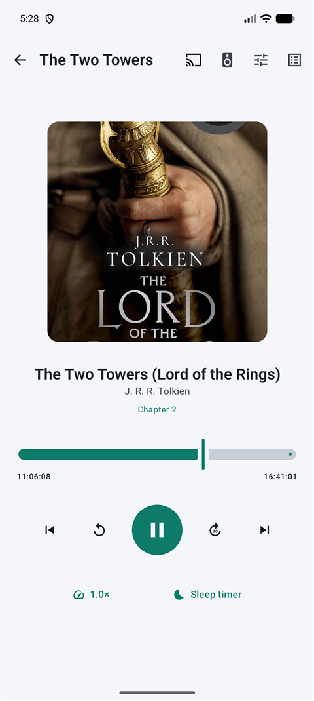
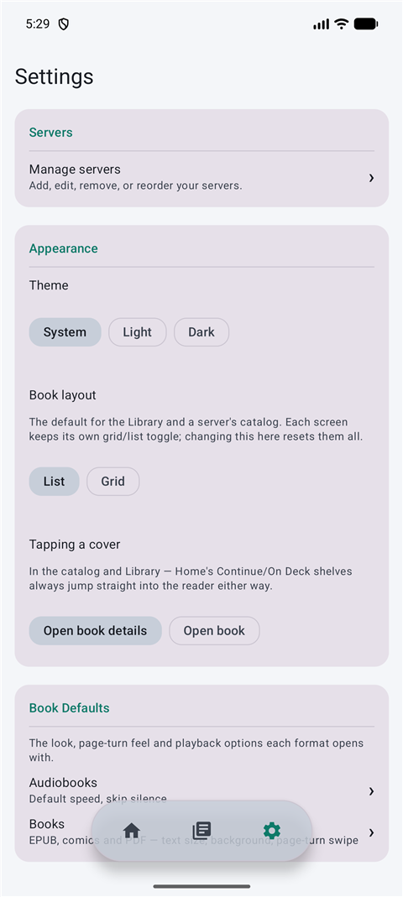

# Dexxicon Reader

A native Android **and** iOS client for self‑hosted book, comic and audiobook libraries —
one app, feature-equal on both platforms, with your library in your pocket, on your tablet,
and **in the car** through Android Auto and Apple CarPlay. Built for **BookOrbit** (primary)
and **Grimmory / BookLore** (secondary), talking to their own REST APIs — the same ones
their web readers use — rather than generic OPDS.

  
  
  
  

  

<table>
  <tr>
    <td align="center"> Home</td>
    <td align="center"> Library</td>
    <td align="center"> Book Detail</td>
  </tr>
  <tr>
    <td align="center"> Audiobook Player</td>
    <td align="center"> Settings</td>
    <td></td>
  </tr>
</table>

## Install

### iOS

1. Join the beta via TestFlight: **[testflight.apple.com/join/JGZW1hqK](https://testflight.apple.com/join/JGZW1hqK)**.
2. Install the TestFlight app if you don't have it, then install Dexxicon Reader through it.
3. Open the app, add your server (URL + your normal account, or **Sign in with SSO** if your
   server has an identity provider configured), and your library shows up.

### Android

1. Download the latest APK from [Releases](https://github.com/dexxfm/dexxicon-reader/releases)
2. Install it — Android will prompt to allow installs from your browser/file manager the first
   time; no other setup is required.
3. Open the app, add your server (URL + your normal account, or **Sign in with SSO** if your
   server has an identity provider configured), and your library shows up. See
   [docs/SETUP.md](docs/SETUP.md) if you're setting up SSO for the first time — it needs a
   one-time redirect-URI addition on the identity provider's side.

Building from source instead? See [BUILD.md](BUILD.md).

## Features

### Browse & open
- Add multiple servers; per‑server sign‑in with username + password (native JWT, auto‑refresh)
  or **OIDC / SSO** through an in‑app WebView. Sessions are refreshed proactively in the
  background; if an SSO session can no longer be renewed the app prompts you to sign in
  again rather than failing silently.

> **SSO / OIDC needs `offline_access`.** A long‑lived refresh token is only issued when the
> authorize request includes the `offline_access` scope *and* the identity provider allows
> it. The app now appends `offline_access` to the scopes automatically, but the IdP side
> must permit it: in **Authentik**, add the *offline_access* scope mapping to the OAuth2
> provider (and to the application's allowed scopes); on **BookLore / BookOrbit**, leave
> the OIDC "scopes" setting blank or include `offline_access` so it isn't stripped.
> Without it an SSO session dies the moment its short access token expires and the only
> recovery is a manual re‑sign‑in.
- Browse the whole library with shelves/facets, search, sort and infinite scroll; covers
  load through the authenticated client.
- **Stream‑first**: books open over authenticated HTTP range requests. "Make available
  offline" is a per‑book opt‑in; the readers and player prefer a local copy when present.
- Book detail shows description, metadata and the real file type (`epub`, `cbz`, `cbr`,
  `m4b`, `pdf`, …).
- Two bottom tabs: **Home** (Continue reading / listening, On Deck, Downloaded) and
  **Library** (every server's books merged into one searchable list).
- Pull‑to‑refresh on Home, Library and Settings; Home shows when it last synced and which
  server, if any, didn't.

### Readers — identical on Android and iOS
One shared UI (Kotlin Multiplatform + Compose) drives the reading experience on both
platforms, so the settings sheet, gestures and sync behaviour you learn on one match the
other exactly.

| Format | Reader |
|---|---|
| **EPUB** | Readium — font size, light/sepia/dark themes, paged or scrolling, TOC, tap **and swipe** to turn pages, highlights & notes, **bookmarks** |
| **Comic** — CBZ **and CBR** | Readium image navigator + page slider + pinch zoom + drag‑to‑turn with adjustable sensitivity + **two‑page spread** on tablets/iPad/unfolded foldables, with auto‑detected right‑to‑left (manga) reading order. `.cbr` (RAR) is unpacked and cached as CBZ on first open |
| **PDF** | Readium + PDFium — page/scroll modes, outline, zoom, drag‑to‑turn with adjustable sensitivity, display settings, page bookmarks |
| **Audiobook** — M4B / MP3 / … | Background playback, lock‑screen & notification controls (Now Playing / Control Center on iOS), chapter list, scrubber |

Audiobook extras: playback speed, sleep timer (timed or **end of chapter**), **skip
silence**, configurable skip‑forward/back intervals, rewind‑on‑resume. The player shows
the current audio route (speaker / Bluetooth / headphones / AirPlay) and opens the system
output switcher in one tap — Android also gets **Google Cast**. A mini‑player bar sits
above the bottom navigation while audio is active; its **X** ends playback and clears the
notification.

MOBI / AZW3 / FB2 are recognised but not yet openable (converters are a work in progress).

### In the car — Android Auto & Apple CarPlay
Your audiobook library, browsable and playable without touching your phone:

- **A full browsable library**, not just a bare now‑playing screen: Continue listening,
  Downloaded, and All audiobooks (split per server if you have more than one) — Android
  Auto adds search on top.
- **A real Now Playing screen** with cover art, current chapter, and a scrubber. Android
  Auto shows rewind‑15 / play / forward‑30; CarPlay adds a dedicated **playback‑speed**
  button in place of a sleep timer — you don't need a sleep timer while driving.
- Playback picks up exactly where you left off and syncs your position back to the server
  the moment you're within range again. Downloaded books play with no signal at all.

### Sync — two‑way
- **Reading & listening position** round‑trips with the server, so you resume on your phone
  exactly where the website left off, and vice‑versa:
  - BookOrbit / Grimmory → the server's own progress API (identical to the web reader).
  - Generic OPDS servers → the **KOReader `kosync`** protocol (per‑server sync account,
    configured in Settings).
- **Highlights & notes** sync to the server's annotation API (BookLore full CRUD, BookOrbit
  read‑only).
- **EPUB bookmarks** sync both ways with the server's bookmark API (BookOrbit and Grimmory
  both full CRUD). A bookmark you made in a server's web reader shows up in the app and
  jumps to its chapter.
- "Continue reading", "Continue listening" and "On Deck" (your *Want to read* list) shelves
  on the Home screen; `Settings →
  Reading sync` shows each server's channel and when it last synced.

### Settings
- **Servers** — drag to set display priority (used for the server list, the sync list, and
  which library's books come first when browsing).
- **Appearance** — theme (system / light / dark), the default book layout (grid or list)
  for the Library and server catalogues (each screen keeps its own toggle), default sort
  order for Library and server browsing, and **Glass intensity** for the floating nav bar.
- **Downloads** — Wi‑Fi‑only queueing and a total storage cap (default 10 GB); a download
  that would exceed the cap is skipped.
- **Reading sync** — per‑server channel and last‑synced time; `kosync` account setup for
  generic OPDS servers.

### Design & privacy
- A real‑time, frosted **liquid‑glass backdrop blur** on the floating pill navigation bar —
  not a flat translucent overlay, an actual live blur of what's scrolling underneath —
  with an intensity slider in Settings if you'd rather tone it down. Jetpack Compose +
  Material 3 on Android, Compose Multiplatform sharing that same design language on iOS;
  adaptive layouts for phones, tablets, foldables and iPad; light/dark, edge‑to‑edge.
- No ads, no analytics, no third‑party SDKs. The app connects only to the servers you add;
  credentials are encrypted on‑device with a hardware‑backed key. Crashes are saved locally
  and only emailed if you choose to, after reviewing the contents. See [PRIVACY.md](PRIVACY.md).

## Status

**v1.0.0** — a complete, polished daily driver for BookOrbit and Grimmory, feature‑equal on
Android and iOS: shared readers, shared sync, shared design, Android Auto and CarPlay both
done, adaptive tablet/foldable/iPad layouts done. See
[Releases](https://github.com/dexxfm/dexxicon-reader/releases) for APKs and Play‑ready App
Bundles, and [CHANGELOG.md](CHANGELOG.md) for what each version brought.

A [baseline profile](PERF.md) ships with Android release builds.

**Not done yet:** MOBI/AZW3/FB2 conversion, OPDS‑PSE comic page streaming. Kobo sync was cut.

## Licence

[MIT](LICENSE) — free to use, modify and fork. Keep the copyright notice and licence text,
and credit the original project (`github.com/dexxfm/dexxicon-reader`).

Bundled third‑party components keep their own licences: Readium toolkit — BSD‑3‑Clause;
Media3 / AndroidX — Apache‑2.0; junrar — UnRar restriction + free for non‑extraction‑tool
use.

## Support

If Dexxicon Reader is useful to you, consider buying me a coffee:
[ko-fi.com/dexxfm](https://ko-fi.com/dexxfm)

